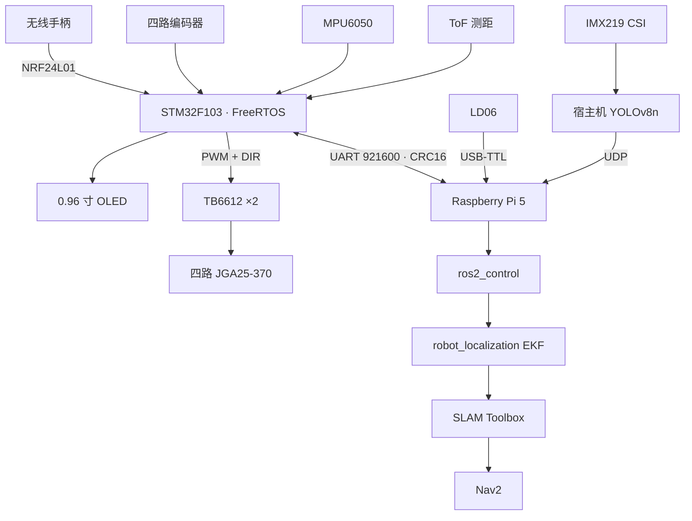

<div align="center">

# MCR · 麦克纳姆轮自主移动机器人

**STM32F103 + FreeRTOS + Raspberry Pi 5 + ROS 2 Jazzy**

从实时电机控制、无线遥控和自定义串口协议，到 `ros2_control`、传感器融合、SLAM 与边缘视觉的一体化机器人平台。

[](README.md)
[](README_EN.md)

[](https://github.com/finnyoun9/mecanum-robot/actions/workflows/firmware-tests.yml)
[](https://github.com/finnyoun9/mecanum-robot/actions/workflows/ros2-build.yml)


</div>

> [!IMPORTANT]
> 当前主线处于 **M5：移动建图质量优化**。底盘、遥控、Pi↔STM32 链路、ROS 2 控制栈和首次 SLAM 已闭合；下一步是陀螺仪零偏、EKF 融合、重建图和 Nav2 验收。

## 导航

[项目概览](#项目概览) · [当前进度](#当前进度) · [系统架构](#系统架构) · [验证数据](#验证数据) · [快速开始](#快速开始) · [路线图](#路线图) · [文档索引](#文档索引)

## 项目概览

MCR 是一套真实硬件驱动的全栈机器人系统。STM32 负责确定性控制与安全，Raspberry Pi 5 运行 ROS 2、融合定位、SLAM 和感知；两端通过带 CRC16 的二进制协议通信。

项目强调可验证性：同一套核心固件同时用于真机目标、主机单元测试和 SIL 软件在环；项目状态严格区分真机实测、测试验证与推导结果。

### 核心能力

- 四路麦克纳姆轮速度闭环、前馈、斜坡限速与零速消抖
- NRF24L01 无线全向遥控、急停、失联停车与 Pi/手柄优先级仲裁
- MPU6050、ToF、OLED、编码器、LD06 与 IMX219 多传感器接入
- 自定义 UART 二进制协议、CRC16、DMA 环形接收和通信看门狗
- ROS 2 Jazzy、`ros2_control`、EKF、SLAM Toolbox 与 Nav2 配置
- 固件 SIL、主机测试、ROS 2 测试和 GitHub Actions 持续集成

## 当前进度

| 子系统 | 状态 | 证据边界 |
| --- | --- | --- |
| 四轮底盘与闭环控制 | **已真机验证** | 全向基础动作、前馈、停止消抖、正确链路下四轮一致性 |
| 无线遥控与安全 | **已真机验证** | K1、K9、K10、250 ms 看门狗、手柄优先级仲裁 |
| Pi↔STM32 通信 | **已闭合** | 921600 8N1、双向协议、ODOM、ROS 2 硬件接口 |
| IMU / ToF / OLED | **已真机验证** | I2C2 共享总线、连续测距、姿态数据与状态页 |
| LD06 激光雷达 | **已真机验证** | `/scan` 约 10 Hz，静止扫描稳定性良好 |
| ROS 2 整车栈 | **已闭合** | `ros2_control`、控制器、EKF、TF 与里程计话题 |
| SLAM | **进行中** | 已移动建图；当前地图存在扭曲与扫描匹配伪影 |
| Nav2 自主导航 | **待验收** | 配置与启动骨架已具备，尚未完成实车目标点导航 |
| IMX219 + YOLOv8n | **实验可用** | Pi 5 CPU 端约 4.5–6 FPS，ROS UDP 桥已实现 |
| 电池电量显示 | **延期优化** | 条件编译代码与测试已完成，当前不改线、不烧录 |
| 移动机械臂 | **早期骨架** | host protocol 与 SIL 骨架，不属于当前底盘主线 |

完整、按日期更新的证据记录见 [项目状态与协作基线](docs/project-status.md)。

## 系统架构



### 分层职责

| 层 | 技术 | 职责 |
| --- | --- | --- |
| 实时控制 | STM32F103、FreeRTOS、C | 100 Hz 轮速控制、传感器、安全状态机、无线遥控 |
| 边缘计算 | Raspberry Pi 5、Debian 12 | 设备接入、容器运行、CSI 视觉推理 |
| 机器人中间件 | ROS 2 Jazzy、Ubuntu 24.04 Docker | 控制器、TF、融合定位、SLAM、导航、感知桥 |
| 验证 | CTest、SIL、GTest、GitHub Actions | 协议、运动学、控制逻辑、驱动和构建回归 |

## 验证数据

| 指标 | 真机结果 |
| --- | --- |
| 四轮 2.5 rad/s 一致性 | 干净链路下轮间差约 **1.4%** |
| STM32 ODOM | 约 **50 Hz**，有效验证中 CRC 错误为 0 |
| ROS 2 里程计 | 原始约 **100 Hz**，EKF 输出约 **50 Hz** |
| LD06 | `/scan` 约 **10 Hz**；静止点位标准差中位数约 **8.1 mm** |
| CSI 相机 | 640×480 RGB 连续采集约 **30 FPS** |
| YOLOv8n | Pi 5 CPU 端到端约 **4.5–6 FPS** |
| 固件测试 | CMake/CTest **12/12** 通过 |

这些数字只描述对应测试条件，不代表未测的带载极限、续航或最终导航精度。

## 硬件组成

| 模块 | 型号 / 方案 |
| --- | --- |
| 主控 | STM32F103C8T6 Blue Pill |
| 机器人计算机 | Raspberry Pi 5 8GB |
| 底盘 | 四轮 X 型麦克纳姆底盘 |
| 电机与驱动 | JGA25-370 编码器电机 ×4、TB6612FNG ×2 |
| 定位与避障 | MPU6050、LD06、I2C ToF 模组 |
| 交互与遥控 | 0.96 寸 I2C OLED、NRF24L01+ 手柄 |
| 视觉 | IMX219 8MP CSI 相机 |
| 电源 | 3S 锂电池、独立降压与保护链路 |

接线、供电和上电检查分别见 [接线指南](docs/wiring.md) 与 [3S 供电方案](docs/power-system.md)。

## 快速开始

### 1. 克隆仓库

```bash
git clone --recurse-submodules https://github.com/finnyoun9/mecanum-robot.git
cd mecanum-robot
```

### 2. 构建 ROS 2 Jazzy 环境

Pi 保留 Raspberry Pi OS，ROS 2 运行在原生 arm64 Ubuntu 24.04 容器中；CSI 相机留在宿主机。

```bash
./docker/run.sh --build

# 容器内
cd /ros2_ws
colcon build --symlink-install
source install/setup.bash
```

### 3. 构建生产固件

```bash
cd firmware/Core/HW
make clean
make TARGET=rtos_drive RTOS=1 TOF=1 OLED=1 OLED_CTRL=SH1106
```

烧录会复位真机并可能触发项目已知的 I2C 复位问题。操作硬件前先阅读 [真机目标说明](firmware/Core/HW/README.md)。

### 4. 启动机器人与建图

```bash
# 容器内：底盘、雷达、控制器、EKF
ros2 launch mcr_bringup robot.launch.py

# 当前推荐的独立建图模式
ros2 launch mcr_navigation navigation.launch.py nav2:=false rviz:=false
```

### 5. 运行测试

```bash
cmake -S firmware/Core -B firmware/Core/build
cmake --build firmware/Core/build -j4
ctest --test-dir firmware/Core/build --output-on-failure
```

## 可视化

<details>
<summary><strong>展开 RViz2 验证截图</strong></summary>

| 机器人模型 | 全向轨迹进行中 | 方形轨迹完成 |
| --- | --- | --- |
|  |  |  |

</details>

## 路线图

- [x] M1 · 硬件搭建、PWM、方向与编码器标定
- [x] M2 · 单轮与四轮速度闭环、前馈和 SIL
- [x] M3 · 无线遥控、安全状态机与真机基础运动
- [x] M4 · Pi↔STM32、ROS 2 硬件接口与整车话题闭环
- [ ] M5 · 传感器融合、移动建图质量与 Nav2（进行中）
- [ ] M6 · 视觉辅助定位、目标交互与长期可靠性验收

当前最短路径：**陀螺仪零偏校准 → EKF 权重验证 → 重建图 → Nav2 目标点导航 → 30 分钟稳定性测试**。

## 文档索引

| 文档 | 内容 |
| --- | --- |
| [项目状态](docs/project-status.md) | 最新进展、真机证据、阻塞项与下一步 |
| [接线指南](docs/wiring.md) | STM32、TB6612、编码器、I2C、NRF24 引脚 |
| [供电方案](docs/power-system.md) | 3S 电池、电源树、保护与故障记录 |
| [闭环路线](docs/hardware-closed-loop-roadmap.md) | 控制 bring-up、标定和验收方法 |
| [无线遥控](docs/remote_control.md) | 遥控协议、按键、接线与安全行为 |
| [ROS 2 Docker](docker/README.md) | Pi 宿主机、容器、设备和远程 RViz2 |
| [项目亮点](docs/resume-highlights.md) | 可用于简历与面试的证据边界 |

<details>
<summary><strong>仓库结构</strong></summary>

```text
mecanum-robot/
├── firmware/              STM32 底盘、遥控器与机械臂固件
├── shared/                Pi/STM32 共享协议与 CRC16
├── ros2_ws/src/           bringup、description、navigation、perception
├── perception/            CSI/YOLO、相机标定与激光三角法实验
├── tools/                 链路、编码器、轮速、IMU 与 ToF 诊断工具
├── docker/                Raspberry Pi OS 上的 ROS 2 Jazzy 容器
└── docs/                  接线、供电、状态、路线与验证记录
```

</details>

---

<div align="center">

**证据优先，真机优先，安全优先。**

[English Documentation](README_EN.md) · [最新项目状态](docs/project-status.md)

</div>
