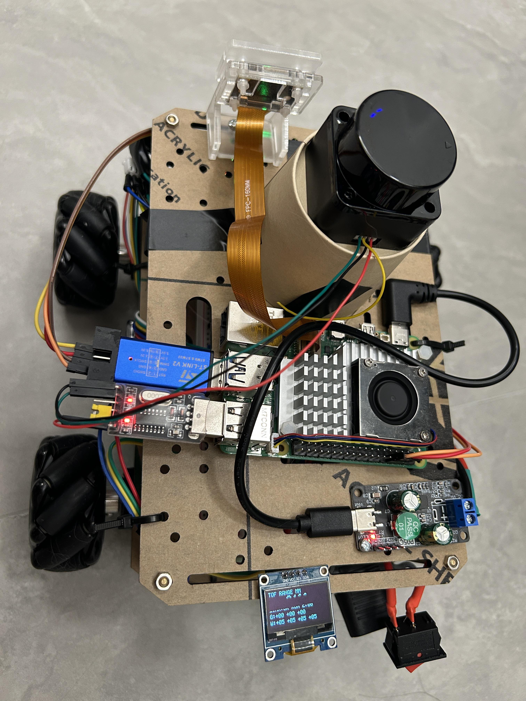
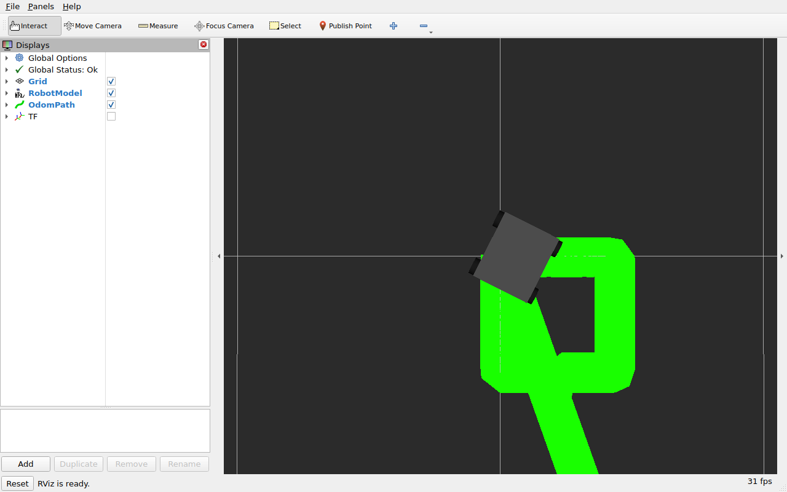
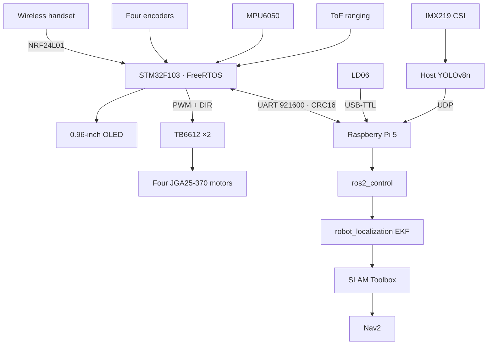
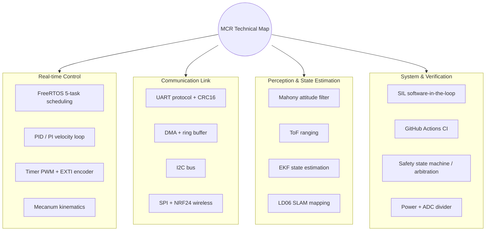
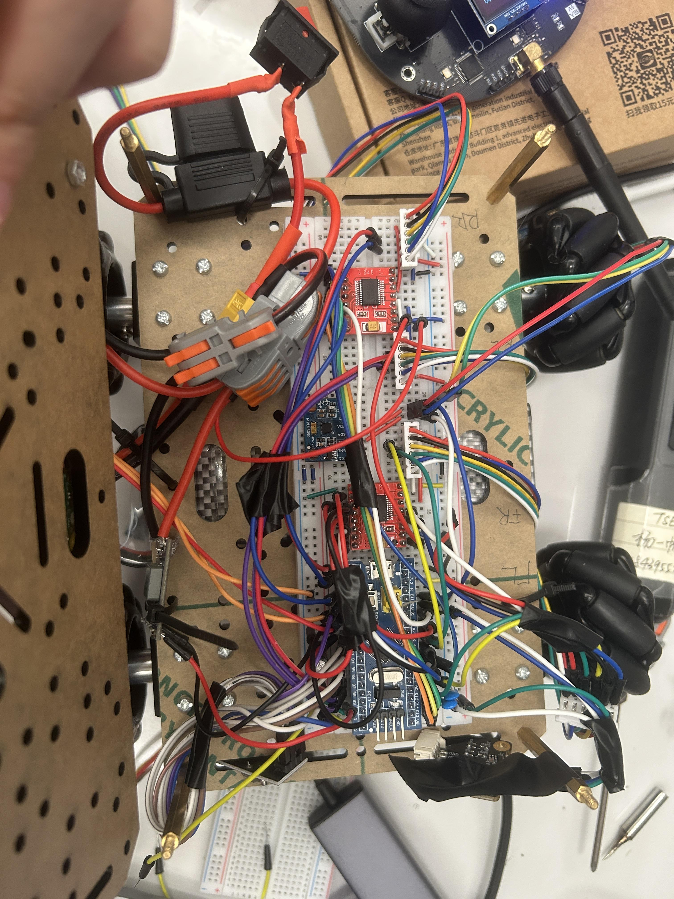
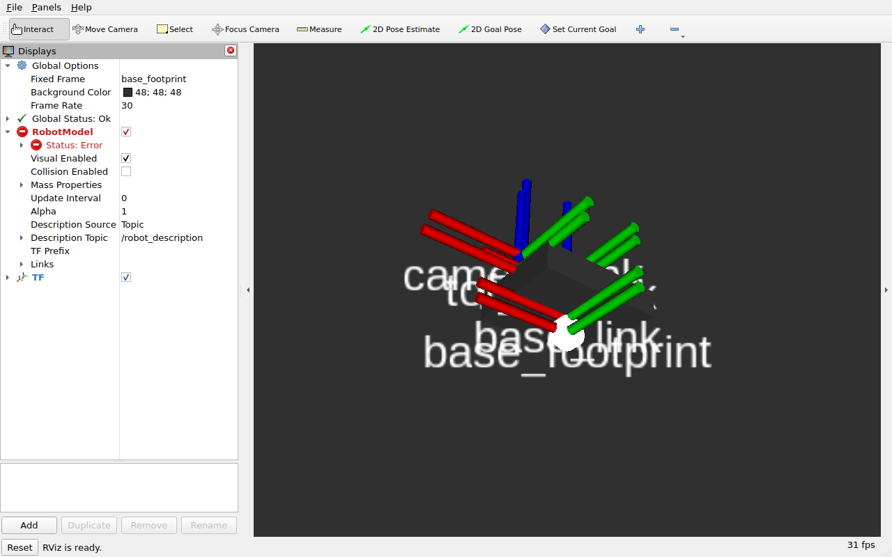
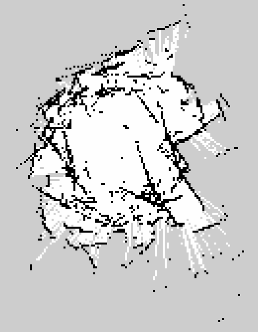
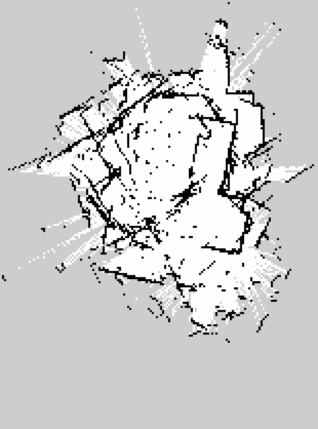

<div align="center">

# MCR · Mecanum Autonomous Mobile Robot

**STM32F103 + FreeRTOS + Raspberry Pi 5 + ROS 2 Jazzy**

An integrated robotics platform spanning real-time motor control, wireless teleoperation, a custom serial protocol, `ros2_control`, sensor fusion, SLAM, and edge vision.

[](README.md)
[](README_EN.md)

[](https://github.com/finnyoun9/mecanum-robot/actions/workflows/firmware-tests.yml)
[](https://github.com/finnyoun9/mecanum-robot/actions/workflows/ros2-build.yml)




<sub>Top view · 2026-08-31 · Pi 5 + IMX219 + LD06 + ToF/OLED onboard</sub>



</div>

> [!IMPORTANT]
> The main track is now **M5: mobile mapping quality**. The chassis, handset, Pi-to-STM32 link, ROS 2 control stack, and first SLAM run are closed. Next: gyro bias, EKF tuning, remapping, and Nav2 validation.

## Navigation

[Overview](#overview) · [Status](#current-status) · [Architecture](#architecture) · [Evidence](#measured-evidence) · [Quick Start](#quick-start) · [Roadmap](#roadmap) · [Documentation](#documentation)

## Overview

MCR is a full-stack robot built around real hardware. An STM32 handles deterministic control and safety, while a Raspberry Pi 5 runs ROS 2, fused localization, SLAM, and perception. A CRC16-protected binary protocol connects both layers.

Verification is a design goal. The same core firmware is exercised by hardware targets, host unit tests, and software-in-the-loop tests. Project records distinguish measured hardware evidence from simulated or inferred results.

### Highlights

- Four independent mecanum wheel speed loops with feedforward, slew limiting, and zero-speed settling
- NRF24L01 omnidirectional handset with e-stop, link-loss stop, and handset/Pi command arbitration
- MPU6050, ToF, OLED, encoders, LD06, and IMX219 sensor integration
- Custom UART binary protocol with CRC16, DMA circular reception, and communication watchdogs
- ROS 2 Jazzy, `ros2_control`, EKF, SLAM Toolbox, and Nav2 configuration
- Firmware SIL, host tests, ROS 2 tests, and GitHub Actions CI

## Current Status

| Subsystem | Status | Evidence boundary |
| --- | --- | --- |
| Chassis and closed-loop control | **Hardware verified** | Omnidirectional motion, feedforward, clean stopping, wheel consistency |
| Wireless control and safety | **Hardware verified** | K1, K9, K10, 250 ms watchdog, handset-priority arbitration |
| Pi-to-STM32 transport | **Closed** | 921600 8N1, bidirectional protocol, ODOM, ROS 2 hardware interface |
| IMU / ToF / OLED | **Hardware verified** | Shared I2C2 bus, continuous ranging, attitude data, status dashboard |
| LD06 LiDAR | **Hardware verified** | `/scan` near 10 Hz with stable static measurements |
| ROS 2 robot stack | **Closed** | `ros2_control`, controllers, EKF, TF, and odometry topics |
| SLAM | **In progress** | Mobile mapping works; map distortion and scan artifacts remain |
| Nav2 autonomous navigation | **Pending validation** | Configuration exists; real goal navigation is not yet accepted |
| IMX219 + YOLOv8n | **Experimental** | About 4.5–6 FPS on Pi 5 CPU; ROS UDP bridge implemented |
| Battery display | **Deferred** | Feature-gated firmware and tests exist; no current rewiring or flash |
| Mobile manipulator | **Early scaffold** | Host protocol and SIL skeleton; outside the chassis critical path |

See the dated [project status and evidence log](docs/project-status.md) for the authoritative boundary.

## Architecture



### Responsibility by Layer

| Layer | Technology | Responsibility |
| --- | --- | --- |
| Real-time control | STM32F103, FreeRTOS, C | 100 Hz wheel control, sensors, safety state, wireless control |
| Edge compute | Raspberry Pi 5, Debian 12 | Device access, containers, native CSI inference |
| Robotics middleware | ROS 2 Jazzy, Ubuntu 24.04 Docker | Controllers, TF, fusion, SLAM, navigation, perception bridge |
| Verification | CTest, SIL, GTest, GitHub Actions | Protocol, kinematics, control, drivers, and build regressions |

## Technical Map

A subsystem-grouped index of the technical topics in this project; theory, code location, and rationale for each node are in [Technical Map details](docs/technical-map.md).



## Measured Evidence

| Metric | Hardware result |
| --- | --- |
| Wheel spread at 2.5 rad/s | About **1.4%** with a clean transport link |
| STM32 ODOM | About **50 Hz**, zero CRC errors in accepted validation runs |
| ROS 2 odometry | Raw near **100 Hz**, EKF output near **50 Hz** |
| LD06 | `/scan` near **10 Hz**; static pointwise median standard deviation about **8.1 mm** |
| CSI capture | 640×480 RGB near **30 FPS** |
| YOLOv8n | About **4.5–6 FPS** end to end on Pi 5 CPU |
| Firmware regression | CMake/CTest **12/12** passing |

These numbers apply only to their recorded test conditions. They do not imply unmeasured payload, endurance, or final navigation performance.

## Hardware

| Module | Model / solution |
| --- | --- |
| Controller | STM32F103C8T6 Blue Pill |
| Robot computer | Raspberry Pi 5 8GB |
| Chassis | Four-wheel X-pattern mecanum base |
| Motors and drivers | JGA25-370 encoder motors ×4, TB6612FNG ×2 |
| Localization and safety | MPU6050, LD06, I2C ToF module |
| Interaction and control | 0.96-inch I2C OLED, NRF24L01+ handset |
| Vision | IMX219 8MP CSI camera |
| Power | 3S LiPo, separated regulators, protection chain |

See [wiring](docs/wiring.md) and the [3S power architecture](docs/power-system.md) before powering hardware.

## Quick Start

### 1. Clone

```bash
git clone --recurse-submodules https://github.com/finnyoun9/mecanum-robot.git
cd mecanum-robot
```

### 2. Build the ROS 2 Jazzy Environment

The Pi keeps Raspberry Pi OS. ROS 2 runs in a native arm64 Ubuntu 24.04 container, while the CSI camera remains on the host.

```bash
./docker/run.sh --build

# Inside the container
cd /ros2_ws
colcon build --symlink-install
source install/setup.bash
```

### 3. Build Production Firmware

```bash
cd firmware/Core/HW
make clean
make TARGET=rtos_drive RTOS=1 TOF=1 OLED=1 OLED_CTRL=SH1106
```

Flashing resets real hardware and can trigger the documented I2C reset issue. Read the [hardware target guide](firmware/Core/HW/README.md) before operating the chassis.

### 4. Launch the Robot and Mapping

```bash
# Inside the container: chassis, LiDAR, controllers, and EKF
ros2 launch mcr_bringup robot.launch.py

# Currently recommended isolated mapping mode
ros2 launch mcr_navigation navigation.launch.py nav2:=false rviz:=false
```

### 5. Run Firmware Tests

```bash
cmake -S firmware/Core -B firmware/Core/build
cmake --build firmware/Core/build -j4
ctest --test-dir firmware/Core/build --output-on-failure
```

## Visualization

<details>
<summary><strong>Open hardware photos</strong></summary>

| Top view (2026-08-31) | Chassis wiring detail |
| --- | --- |
|  |  |

</details>

<details>
<summary><strong>Open the RViz2 validation gallery</strong></summary>

| Robot model | Omnidirectional trajectory | Completed square |
| --- | --- | --- |
|  |  |  |

</details>

<details>
<summary><strong>Open current SLAM mapping state (M5 in progress, not a success case)</strong></summary>

Three stages of the same teleop mapping session (2026-08-30), shown as-is with the current scalloped distortion and scan-matching artifacts, for cross-reference with the gyro-bias investigation logged in [project status](docs/project-status.md). This does not represent finished mapping.

| Stage 1 | Stage 2 | Stage 3 |
| --- | --- | --- |
|  |  |  |

</details>

## Roadmap

- [x] M1 · Hardware, PWM, direction, and encoder calibration
- [x] M2 · Single/four-wheel speed control, feedforward, and SIL
- [x] M3 · Wireless control, safety state machine, and basic hardware motion
- [x] M4 · Pi-to-STM32 transport, ROS 2 hardware interface, and topic closure
- [ ] M5 · Sensor fusion, mobile mapping quality, and Nav2 (in progress)
- [ ] M6 · Vision-assisted localization, interaction, and long-duration validation

Shortest path forward: **gyro bias calibration → EKF validation → remapping → Nav2 goal navigation → 30-minute stability run**.

## Documentation

| Document | Scope |
| --- | --- |
| [Project status](docs/project-status.md) | Latest progress, hardware evidence, blockers, next steps |
| [Technical map](docs/technical-map.md) | Subsystem-grouped topics: theory, code location, rationale |
| [Wiring guide](docs/wiring.md) | STM32, TB6612, encoder, I2C, and NRF24 pinout |
| [Power system](docs/power-system.md) | 3S battery tree, protection, and failure records |
| [Closed-loop roadmap](docs/hardware-closed-loop-roadmap.md) | Control bring-up, calibration, and acceptance |
| [Wireless control](docs/remote_control.md) | Protocol, keys, wiring, and safety behavior |
| [ROS 2 Docker](docker/README.md) | Pi host, container, devices, and remote RViz2 |

<details>
<summary><strong>Repository layout</strong></summary>

```text
mecanum-robot/
├── firmware/              STM32 chassis, handset, and manipulator firmware
├── shared/                Pi/STM32 protocol and CRC16
├── ros2_ws/src/           bringup, description, navigation, perception
├── perception/            CSI/YOLO, calibration, laser triangulation experiments
├── tools/                 link, encoder, wheel, IMU, and ToF diagnostics
├── docker/                ROS 2 Jazzy on Raspberry Pi OS
└── docs/                  wiring, power, status, roadmaps, evidence
```

</details>

---

<div align="center">

**Evidence first. Hardware first. Safety first.**

[中文文档](README.md) · [Latest Project Status](docs/project-status.md)

</div>
