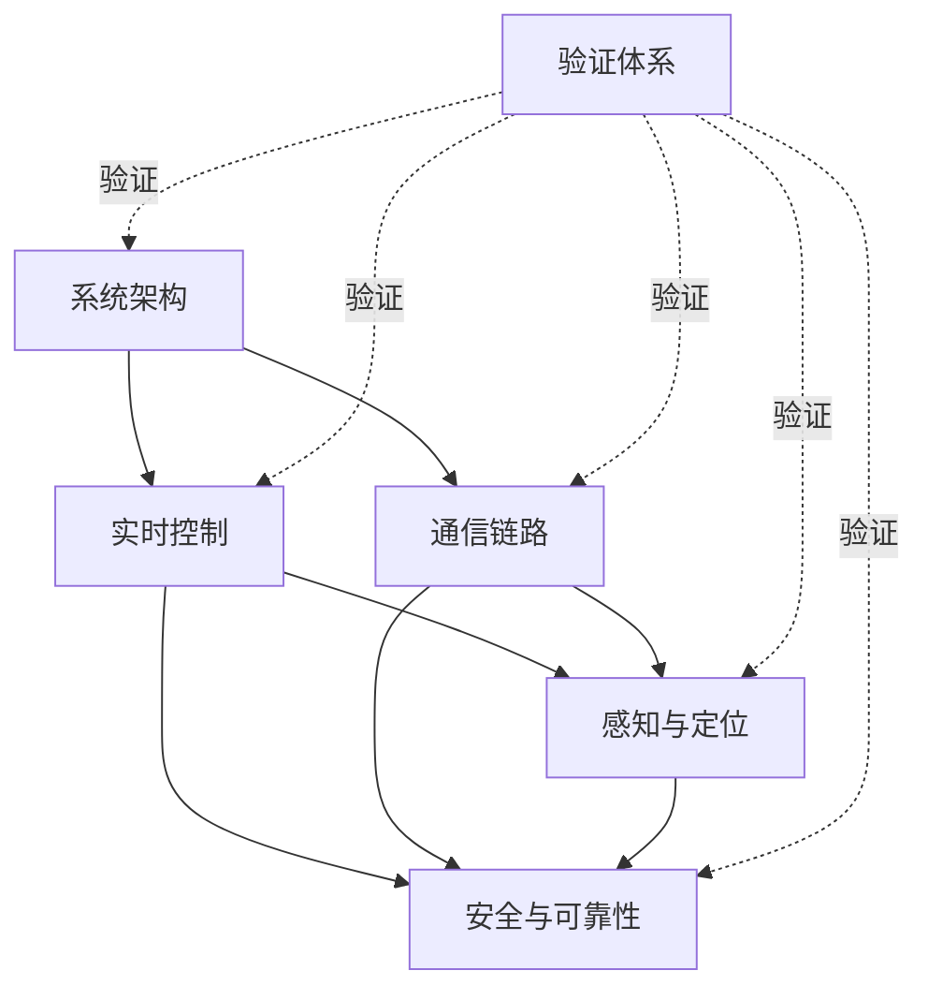

# 技术地图 / Technical Map

本页是一页式技术导航。稳定的原理、架构和取舍进入专题文档；最新完成度和真机数据以[项目状态](project-status.md)为准；物理连接与供电分别以[接线指南](wiring.md)和[供电方案](power-system.md)为准。

## 证据标签

| 标签 | 含义 |
| --- | --- |
| `[CODE]` | 已实现并可构建 |
| `[HOST]` | Linux主机单元测试通过 |
| `[SIL]` | 软件在环闭环通过 |
| `[HW]` | 单模块或台架真机验证 |
| `[SYSTEM]` | 指定场景端到端整车验证 |
| `[PENDING]` | 尚未完成对应验证 |

不同层级不能互相替代。例如`[SIL]`不能证明电气和机械对象，首次`[SYSTEM]`出图也不能证明地图质量、Nav2或长期可靠性达标。

## 专题导航

| 领域 | 核心问题 | 专题入口 | 主要代码入口 | 当前证据 |
| --- | --- | --- | --- | --- |
| 系统架构 | 为什么采用Pi 5 + STM32分层，命令和反馈怎样流动 | [系统架构](technical/01-system-architecture.md) | [`main.c`](../firmware/Core/Src/main.c)、[`mcr_bringup`](../ros2_ws/src/mcr_bringup) | `[SYSTEM]`基础链已闭合 |
| 实时控制 | 如何把`vx/vy/ω`变成稳定、平滑的四轮PWM | [实时控制](technical/02-realtime-control.md) | [`robot_control.c`](../firmware/Core/Src/robot_control.c)、[`encoder.c`](../firmware/Core/Src/encoder.c) | `[HW]`基础闭环；长期带载`[PENDING]` |
| 通信 | UART字节流怎样经过DMA、ring、协议与错误恢复 | [通信链路](technical/03-communication.md) | [`protocol.c`](../shared/protocol.c)、[`serial_protocol.cpp`](../ros2_ws/src/mcr_bringup/src/serial_protocol.cpp) | 921600双向`[SYSTEM]` |
| 感知定位 | 编码器、IMU、ToF和LD06怎样形成里程计与地图 | [感知与定位](technical/04-sensing-localization.md) | [`ahrs.c`](../firmware/Core/Src/ahrs.c)、[`mcr_bringup`](../ros2_ws/src/mcr_bringup) | 传感器`[SYSTEM]`；地图质量`[PENDING]` |
| 安全可靠性 | 失联、近障、堵转和多控制源竞争时怎样停车与恢复 | [安全与可靠性](technical/05-safety-reliability.md) | [`robot_control.c`](../firmware/Core/Src/robot_control.c)、[`remote_control.c`](../firmware/Core/Src/remote_control.c) | 基础安全`[HW]`；长期误报`[PENDING]` |
| 验证 | 如何用单测、SIL、probe和整车测试建立证据链 | [验证体系](technical/06-verification.md) | [`firmware/Core/SIL`](../firmware/Core/SIL)、[`tools`](../tools) | CTest 12/12；多层真机证据 |

## 依赖关系

推荐阅读顺序：系统架构 → 实时控制与通信 → 感知定位 → 安全可靠性 → 验证体系。验证不是最后才做的阶段，而是横跨所有专题的方法。

## 关键实现速查

| 技术点 | 理论关键词 | 实现位置 | 为什么这样做 |
| --- | --- | --- | --- |
| FreeRTOS五任务 | 优先级、周期任务、事件驱动 | [`main.c`](../firmware/Core/Src/main.c) | 100 Hz控制优先，通信和传感器不能阻塞它 |
| 前馈 + PI | 系统辨识、anti-windup、量化 | [`robot_control.c`](../firmware/Core/Src/robot_control.c) | 前馈给基础输出，PI修正模型误差；D会放大量化噪声 |
| 软件EXTI编码器 | 定时器资源、边沿计数 | [`encoder.c`](../firmware/Core/Src/encoder.c) | TIM资源与USART/NRF24冲突后的F103取舍，当前448 edges/圈 |
| 麦轮运动学 | 正/逆运动学、统一缩放 | [`mecanum_ik.c`](../firmware/Core/Src/mecanum_ik.c) | `vx/vy/ω`与四轮角速度双向换算 |
| 自定义协议 | 帧同步、长度、序号、CRC16 | [`protocol.h`](../shared/protocol.h) | C/C++共享契约；CRC检错但不认证 |
| DMA + 软件ring | producer/consumer、IDLE/HT/TC | [`main.c`](../firmware/Core/Src/main.c) | DMA只写staging，任务只读ring，隔离并发和调度抖动 |
| NRF24无线 | SPI寄存器、Auto-ACK、租约 | [`nrf24l01.c`](../firmware/Core/Src/nrf24l01.c) | 独立于Pi的人工接管；SPI响应与无线ACK分层判断 |
| I2C2多设备 | 7位地址、共享总线、访问频率 | [`mpu6050.c`](../firmware/Core/Src/mpu6050.c)、[`tof_sensor.c`](../firmware/Core/Src/tof_sensor.c)、[`ssd1306.c`](../firmware/Core/Src/ssd1306.c) | MPU6050、ToF、OLED共享PB10/PB11，按不同频率调度 |
| Mahony + EKF | 四元数、gyro bias、协方差 | [`ahrs.c`](../firmware/Core/Src/ahrs.c)、[`mcr_bringup`](../ros2_ws/src/mcr_bringup) | MCU提供姿态，Pi融合轮速和IMU；无磁力计yaw仍会漂 |
| 安全状态机 | 故障锁存、迟滞、租约 | [`robot_control.c`](../firmware/Core/Src/robot_control.c) | 不同故障使用不同触发和解除语义 |
| SIL + CI | Mock HAL、对象模型、自动回归 | [`firmware/Core/SIL`](../firmware/Core/SIL)、[Actions](../.github/workflows) | 生产逻辑可在Linux回归，但不替代真机 |

## 文档职责

| 文档 | 唯一职责 |
| --- | --- |
| 本技术地图 | 导航、术语入口和当前证据摘要 |
| `technical/*.md` | 稳定的原理、设计、取舍和验证方法 |
| [项目状态](project-status.md) | 按时间记录最新进展、故障和实测证据 |
| [闭环路线](hardware-closed-loop-roadmap.md) | 电机、编码器和PI实验数据 |
| [接线指南](wiring.md) | 引脚、电压容限与接线步骤 |
| [供电方案](power-system.md) | 电源树、上电纪律与供电故障 |
| [无线遥控](remote_control.md) | 手柄数据包、按键、接线和使用流程 |

新增功能时，先在`project-status.md`记录真实进度；结论稳定后更新对应专题；只有领域入口或证据摘要变化时才修改本页。
