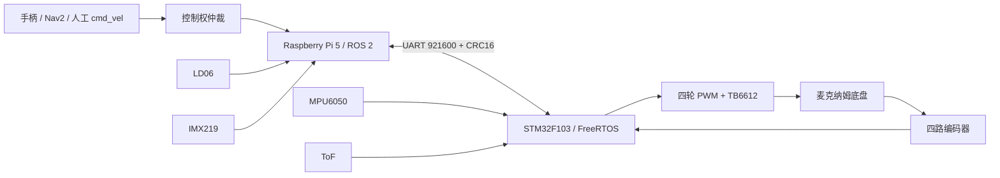

# 系统架构：Pi 5 + STM32 分层

本文解释系统为什么拆成 STM32 实时控制层与 Raspberry Pi 机器人计算层，以及命令、反馈和安全控制如何跨层流动。最新完成度与真机证据以[项目状态](../project-status.md)为准。

## 解决的问题

机器人同时需要固定周期电机控制、硬件故障保护、无线遥控、传感器采样、状态估计、SLAM 和视觉推理。单一处理器可以完成原型，但难以同时兼顾硬实时、安全默认态、Linux 生态和算法迭代效率。

## 设计结论

系统采用异构分层：STM32 负责实时、外设和安全，Pi 5 负责 ROS 2、定位、建图与感知。两端以版本固定的二进制 UART 协议解耦，可以分别开发、模拟和验收。



## 平台职责

| 层 | 主要职责 | 不承担的职责 |
| --- | --- | --- |
| STM32F103 | 100 Hz 轮速控制、PWM、编码器、I2C、NRF24、安全状态机 | SLAM、视觉推理、复杂设备管理 |
| Raspberry Pi 5 | `ros2_control`、TF、EKF、SLAM、工具和视觉实验 | 直接产生电机 PWM、承担最终失联停车 |
| ROS 2 容器 | 控制器、状态估计、建图和导航依赖 | 直接访问 CSI 相机；CSI 推理留在宿主机 |

## 为什么这样选

Pi 5、IMX219、STM32F103 和部分模块是原型阶段已有硬件。已有库存降低了成本和启动时间；是否继续沿用，则由接口、资源、性能和真机结果决定。

Pi 5 提供 Linux、ROS 2 与视觉生态，但普通 Linux 调度不能替代 MCU 的固定周期控制和安全默认态。STM32F103 成本低、工具链成熟，足够闭合当前底盘，但 RAM、定时器和引脚资源已经偏紧。

如果面向下一版产品重新选型，应先做 PWM、编码器、UART、SPI、I2C、ADC 和 RAM 资源预算，再比较 STM32G4/F4、CM4/CM5、RK3588 或 Jetson。当前项目没有做过这些平台的同条件基准，不能声称已经完成产品级选型。

## 正向控制链

```text
/cmd_vel
→ mecanum_drive_controller
→ 四轮目标角速度
→ SerialProtocol 编码
→ Pi TTY / UART
→ STM32 DMA + CommTask
→ robot_handle_command()
→ target_w[]
→ CtrlTask 100 Hz
→ 前馈 + PI
→ PWM / TB6612 / 电机
```

无线手柄走另一条入口：`NRF24 → RemoteTask → 遥控映射 → target_w[]`。两条控制源不是简单的最后写入者获胜，而是由手柄优先租约和超时规则决定控制权。

## 反向反馈链

```text
编码器 / ToF / IMU / 电池状态
→ odom_feedback_t
→ STM32 TX DMA
→ Pi SerialProtocol 解码
→ ros2_control joint/sensor state
→ 麦轮正运动学
→ odom / EKF / TF / SLAM
```

LD06 和 IMX219 直接连接 Pi，不经过 STM32。ToF 是近距离安全传感器，LD06 用于 2D 扫描，摄像头目前用于独立感知实验；三者职责不同。

## FreeRTOS 任务模型

| 任务 | 周期/触发 | 优先级 | 职责 |
| --- | --- | ---: | --- |
| CtrlTask | 100 Hz | 4 | 轮速控制、里程计、看门狗 |
| CommTask | UART 事件 | 3 | DMA ring 排空后的协议解析 |
| SensorTask | 10 ms 基准 | 2 | IMU 100 Hz、ToF 20 Hz、OLED 1 Hz |
| RemoteTask | 20 Hz | 2 | NRF24 收包、手柄状态 |
| MonitorTask | 1 Hz | 1 | 栈高水位与运行状态 |

控制任务优先级最高，因为采样周期抖动会改变离散控制器行为。通信和传感器不允许长时间阻塞控制环；中断只处理边沿、搬运和通知。

## 关键接口

| 接口 | 配置 | 用途 |
| --- | --- | --- |
| USART1 | PA9/PA10，921600 8N1，DMA | Pi↔STM32 命令与反馈 |
| I2C2 | PB10/PB11，100 kHz | MPU6050、ToF、OLED |
| 软件 SPI | PA8/PA15/PB3/PB4/PB5 | NRF24L01 |
| TIM2/3/4 | 四路 PWM | TB6612 电机控制 |
| GPIO EXTI | 四路编码器 A 相双边沿 | 448 edges/圈速度反馈 |

实际引脚、供电和电压容限只在[接线指南](../wiring.md)与[供电方案](../power-system.md)维护，本文不复制完整接线表。

## 实现入口

- [`firmware/Core/HW/rtos_drive_main.c`](../../firmware/Core/HW/rtos_drive_main.c)：时钟、GPIO、UART DMA、I2C 和生产固件入口。
- [`firmware/Core/Src/main.c`](../../firmware/Core/Src/main.c)：FreeRTOS 任务、DMA 回调和任务创建。
- [`firmware/Core/Src/robot_control.c`](../../firmware/Core/Src/robot_control.c)：控制、安全和遥测状态。
- [`ros2_ws/src/mcr_bringup`](../../ros2_ws/src/mcr_bringup)：ROS 2 硬件接口、串口协议和运动学。

## 验证证据

| 结论 | 证据级别 | 当前证据 |
| --- | --- | --- |
| FreeRTOS 生产固件可运行 | `[HW]` | UART、IMU、ToF、OLED、NRF24 已分别并入并真机闭合 |
| Pi↔STM32 双向链路 | `[SYSTEM]` | 12 s 内 615 个有效帧、ODOM 50.2 Hz、CRC 0、ACK 12/12 |
| ROS 2 整车数据链 | `[SYSTEM]` | `cmd_vel → PWM → encoder → odom → EKF/TF → SLAM` 已闭合 |
| 最终导航能力 | `[PENDING]` | Nav2 目标点和地图质量尚未验收 |

## 当前边界

首次移动建图不等于定位与导航完成。当前仍需处理 gyro 零偏、EKF 权重和地图扭曲；长期带载、30 分钟稳定性、续航与电池百分比校准也没有完成。

## 面试追问

1. 为什么不让 Pi 直接控制 PWM？
2. 为什么不用一颗性能更强的 MCU 完成全部功能？
3. 现有硬件与正式产品选型有什么区别？
4. 两个控制源如何避免同时写目标轮速？
5. 哪些安全功能必须留在 STM32？
