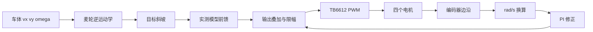

# 实时控制：从车体速度到四轮 PWM

本文解释麦克纳姆运动学、编码器、前馈、PI 和 FreeRTOS 周期控制如何组成四轮速度闭环。实验过程和完整数据保存在[真机闭环路线](../hardware-closed-loop-roadmap.md)。

## 解决的问题

四个直流电机存在死区、增益差异、供电变化和编码器量化。只给相同 PWM 不能保证相同轮速；停止附近持续追逐量化误差，还会产生正反向咔哒声。

## 控制链



## 麦克纳姆逆运动学

项目坐标约定：前方为 `+vx`，左方为 `+vy`，逆时针为 `+ω`；轮序为 FL、FR、RL、RR。X 型滚子布局下：

```text
FL = (vx - vy - Lω) / R
FR = (vx + vy + Lω) / R
RL = (vx + vy - Lω) / R
RR = (vx - vy + Lω) / R
```

`R=0.030 m`，`L=lx+ly=0.1525 m`。四轮超限时必须按同一比例缩放，才能保持期望运动方向，而不是逐轮独立裁剪。

正运动学用四轮实际速度反推 `vx、vy、ω`，供里程计使用。麦轮横移和转弯容易打滑，因此轮式里程计仍需与 IMU、激光扫描配合。

## 编码器与资源取舍

TIM2/3/4 已用于四路 PWM；TIM1 的关键通道又与 NRF24 CE 和 USART1 TX 冲突。项目没有足够定时器同时支持四路硬件 Encoder Mode，因此使用 GPIO EXTI 软件解码。

当前生产解码统计 A 相双边沿，标定值为 448 edges/圈。它不是完整 AB 四倍频；优势是无需重分配 PWM，引入的代价是更多中断负载、更粗的低速分辨率和更严格的毛刺处理。

速度换算为：

```text
wheel_rad_s = Δedges / 448 / Δt × 2π
```

手转 10 圈两次得到 2240/2244 edges，是一倍频约 224 edges/圈的实测依据。升级双边沿后，同占空比计数约为原来的 1.96–1.98 倍。

## 前馈 + PI

前馈使用占空比—转速实测模型给出基础输出，PI 只修正模型、负载和轮间差异：

```text
u = feedforward(target) + Kp·error + Ki·integral
```

生产默认值位于[`robot_control.h`](../../firmware/Core/Inc/robot_control.h)：`Kp=15`、`Ki=35`、`Kd=0`。单轮实验的`100/300`只用于独立FR台架，不能当作当前四轮生产参数。

D 项会放大编码器量化噪声，现阶段没有带来足够收益。积分上限按`PID_CORRECTION_MAX / Ki`计算，限制的是积分项能贡献的输出，避免执行器饱和后仍持续积累误差。

## 平滑与零速行为

目标每个控制周期限制变化量，避免摇杆或串口命令形成瞬时阶跃。接近零速时清理积分与PWM，避免控制器在静摩擦区反复正反输出。

这两项修复了“停止后继续咔咔响”的问题。它不是机械结构修复，而是目标斜坡、低速量化和控制器内部状态共同决定的零速策略。

## 实时调度

CtrlTask 使用`vTaskDelayUntil()`维持100 Hz周期，优先级4为系统最高任务优先级。通信、传感器和显示必须避免阻塞它。

单轮实验中周期约10000 µs，观测抖动约±3 µs。这个数据来自特定台架实验，不能直接代表所有功能同时运行时的最坏执行时间。

## 故障与保护

速度环外还包含输出限幅、通信看门狗、ToF停车、堵转检测和故障锁存。控制器不能因为新的有效命令到达就自动清除所有故障；解除语义见[安全与可靠性](05-safety-reliability.md)。

## 实现入口

- [`mecanum_ik.c`](../../firmware/Core/Src/mecanum_ik.c)：STM32逆运动学和统一缩放。
- [`mecanum_kinematics.cpp`](../../ros2_ws/src/mcr_bringup/src/mecanum_kinematics.cpp)：ROS 2正/逆运动学。
- [`encoder.c`](../../firmware/Core/Src/encoder.c)：边沿计数与速度换算。
- [`pid.c`](../../firmware/Core/Src/pid.c)：通用PID算法。
- [`robot_control.c`](../../firmware/Core/Src/robot_control.c)：前馈、斜坡、四轮闭环与安全联动。

## 验证证据

| 结论 | 证据级别 | 当前证据 |
| --- | --- | --- |
| 运动学符号与缩放 | `[HOST]` | `test_mecanum_ik`覆盖前进、横移、旋转和限幅 |
| 编码器工程量换算 | `[HW]` | 40%时约10.24–10.38 rad/s，与独立扫速10.25交叉验证 |
| 单轮PI | `[HW]` | 10 rad/s、`100/300`台架稳态误差约0.2% |
| 四轮基础闭环 | `[HW]` | 目标2.5 rad/s，实测约2.39–2.49 rad/s |
| 长期带载性能 | `[PENDING]` | 30分钟、量化跟踪误差和最终负载曲线未验收 |

## 替代方案与边界

资源更充足的MCU可以使用四路硬件编码器、输入捕获或更高分辨率采样。当前软件EXTI是F103资源约束下的工程取舍，不是普遍优于硬件Encoder Mode。

当前PI参数基于现有电机、供电和基础地面测试。更换减速比、电机、轮径、负载或电源后，应重新测前馈模型并复验控制参数。

## 面试追问

1. 为什么先做前馈再用PI修正？
2. 单轮`100/300`为什么不能直接套四轮？
3. 编码器量化怎样影响低速超调和D项？
4. 为什么统一缩放轮速，而不是逐轮裁剪？
5. 软件EXTI编码器的CPU上限怎样估算？
