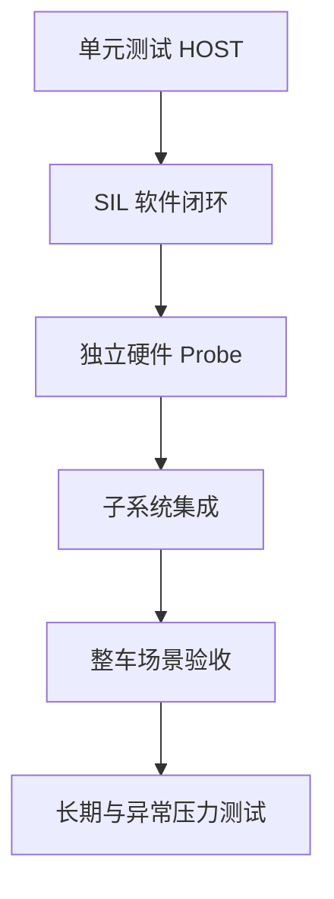

# 验证体系：单测、SIL、独立 Probe 与真机闭环

本文回答“如何证明项目不是只写了代码”。验证按风险分层，不把主机测试、SIL、单模块真机和整车结果相互替代。

## 证据等级

| 标签 | 含义 | 能证明 | 不能证明 |
| --- | --- | --- | --- |
| `[CODE]` | 已实现并可构建 | 接口和逻辑存在 | 运行正确 |
| `[HOST]` | Linux主机单元测试 | 纯逻辑、边界和算法 | 外设与真实调度 |
| `[SIL]` | 软件在环 | 多模块软件闭环随时间演化 | 电气、机械、真实外设时序 |
| `[HW]` | 单模块/台架真机 | 引脚、波形、外设或局部控制 | 完整整车协同 |
| `[SYSTEM]` | 整车链路验收 | 指定场景端到端结果 | 未覆盖环境与长期可靠性 |
| `[PENDING]` | 未验证 | 设计意图 | 任何完成性主张 |

## 验证层次



越往上越接近真实系统，但定位成本也越高。项目先用低层测试排除逻辑问题，再以独立probe验证电气和外设，最后闭合整车链路。

## 主机单元测试

`firmware/Core`当前CTest共12项：

```text
sil_firmware_ci
test_pid
test_mecanum_ik
test_ahrs
test_remote_control
test_encoder
test_stall
test_mpu6050
test_tof_sensor
test_ssd1306
test_oled_ui
test_battery
```

单测覆盖确定性算法、边界输入和错误恢复。它们运行快，适合每次提交回归；但mock返回成功不代表真实I2C会ACK，也不代表轮子实际按期望方向转动。

## SIL软件在环

Mock HAL通过include路径优先级影子化STM32 HAL头文件，让生产固件源码在Linux上编译。Mock FreeRTOS以合作式调度推进任务，软件电机模型把PWM转换为虚拟编码器反馈。

```text
协议命令
→ CommTask
→ CtrlTask / PI
→ 虚拟PWM
→ 电机对象模型
→ 虚拟编码器
→ ODOM帧
```

SIL比孤立函数测试多覆盖任务、协议、控制器和反馈之间的组合。它发现过编码器初始化清空句柄、UART对象分叉、协议返回值判断、零payload状态机和ring溢出恢复等问题。

SIL不能验证GPIO电平、DMA寄存器行为、供电、机械负载、线束松动和真实RTOS抢占时序。Pi↔真实STM32闭合后也不能替代带载和整车长期测试。

## 独立硬件 Probe

每个probe只打开必要外设，减少“整车不工作”时的变量数量：

| Probe/目标 | 隔离的问题 |
| --- | --- |
| `bringup` | 时钟、Flash、PC13和ST-Link |
| 单轮/四轮debug | GPIO、PWM、方向、STBY和H桥 |
| `encoder_port_check` | 生产`encoder.c`的计数与rad/s换算 |
| `nrf24_spi_probe` | MISO、SPI时序和STATUS寄存器 |
| `i2c_bus_probe` | MPU6050、ToF、OLED地址和总线 |
| `uart_link_probe` | 不启动电机时的Pi↔STM32协议传输 |

Probe通过后再并入`rtos_drive`，可以区分模块故障、任务未创建、资源冲突和系统仲裁问题。

## 真机工具与可观测性

| 工具 | 观察点 |
| --- | --- |
| ST-Link/OpenOCD/GDB | PC、SP、Fault寄存器、任务状态和全局计数 |
| `link_check.py` | 帧头、CRC、ODOM频率和ACK |
| `uart_baud_sweep.py` | 实际波特率和干净帧流 |
| `drive_check.py` | Pi命令到真实PWM/编码器的端到端链 |
| `wheel_calibration.py` | 单轮隔离、轮间差异和链路前置检查 |
| `imu_watch.py` / `tof_watch.py` | 传感器有效性、频率和错误标志 |
| ROS 2 topic/TF工具 | Topic频率、坐标变换、EKF和SLAM输入 |

任何轮速、传感器或控制结论前先运行链路健康检查。项目曾把链路降级误判成RR电机或PID差异，因此“先证明传输干净”已经成为固定验收前置条件。

## 真实调试案例

### UART 921600链路

现象包括双向数据异常、Pi发送缓冲填满和STM32 lockup。排查分别验证Pi TTY、物理导通、STM32时钟/BRR、DMA错误计数和协议帧。

最终修复Pi termios的B0错误并恢复STM32运行状态。验收得到12 s 615个有效帧、ODOM 50.2 Hz、CRC 0、ACK 12/12。

### ToF离散数值

距离只出现257/514/771。通过同一寄存器窗口对比burst与逐字节读取，证明低字节被复制到高字节；修复后8 s得到401帧和38个不同距离。

### NRF24模块

快速和约100 kHz慢速SPI都读`STATUS=0x00`，换新模块后两种时序均为`0x0E`。这同时排除了“只有软件SPI太快”和“GPIO完全不可用”两类假设。

## CI

GitHub Actions运行主机构建、CTest和ROS 2相关检查，使协议、PID、运动学、驱动和SIL错误不会只依赖人工回忆。

CI验证的是仓库可重复构建和自动测试结果，不等于持续连接真实机器人。硬件结果必须保留测试条件、命令、原始数据和证据等级。

## 证据记录规则

每个结论至少记录：固件目标和commit、接线/供电、测试条件、输入、观察量、结果、失败判据和未覆盖范围。数字必须带单位和条件。

`project-status.md`记录时间线和最新证据；专题文档只保留稳定结论和验证入口；实验原始数据放在对应工具或闭环路线，不在多处复制。

## 当前验证矩阵

| 子系统 | HOST/SIL | 单模块HW | SYSTEM | 主要缺口 |
| --- | --- | --- | --- | --- |
| 协议与UART | 已完成 | 已完成 | 已完成 | 历史lockup根因、长期洪流 |
| 四轮控制 | 已完成 | 已完成 | 基础运动已完成 | 30分钟带载与量化地面误差 |
| NRF24 | 已完成 | 已完成 | 基础遥控已完成 | 距离、干扰与丢包率 |
| IMU/ToF/OLED | 已完成 | 已完成 | 已进入ODOM/UI | gyro bias和动态精度 |
| LD06/SLAM | ROS检查 | 已完成 | 首次出图 | 地图质量、EKF和Nav2 |
| 电池监测 | 已完成 | 未完成 | 未完成 | 接线、烧录、万用表校准 |

## 面试追问

1. SIL与单元测试、HIL、整车测试分别覆盖什么？
2. Mock HAL为什么不能证明真实外设可用？
3. 一个probe应该如何控制变量？
4. 修复后怎样设计回归，避免只验证正常路径？
5. 如何证明一个数字不是“代码自洽”而是真实工程量？
